# HTML代码分享工具 - 项目架构文档

## 变更记录 (Changelog)

- **2025-09-03**: 初始化项目架构分析，创建根级和模块级文档
- **项目创建**: 基于Express.js的HTML代码分享工具

## 项目愿景

构建一个安全、高效的HTML代码分享平台，支持多种内容类型（HTML、Markdown、Mermaid图表、SVG）的渲染和分享，提供完整的API接口和管理后台。

## 架构总览

```mermaid
graph TD
    A["(根) HTML代码分享工具"] --> B["models"];
    A --> C["routes"];
    A --> D["middleware"];
    A --> E["utils"];
    A --> F["views"];
    A --> G["public"];
    A --> H["scripts"];
    A --> I["tests"];
    A --> J["docs"];
    
    B --> B1["db.js - 数据库初始化"];
    B --> B2["pages.js - 页面数据模型"];
    B --> B3["apiKeys.js - API密钥管理"];
    
    C --> C1["pages.js - 页面路由"];
    
    D --> D1["auth.js - 认证中间件"];
    D --> D2["apiKey.js - API密钥验证"];
    D --> D3["responseTimeMonitor.js - 性能监控"];
    
    E --> E1["memoryOptimizer.js - 内存优化"];
    E --> E2["cacheManager.js - 缓存管理"];
    E --> E3["codeDetector.js - 代码类型检测"];
    E --> E4["contentRenderer.js - 内容渲染器"];
    
    F --> F1["layouts - 布局模板"];
    F --> F2["partials - 部分模板"];
    F --> F3["admin - 管理后台模板"];
    
    G --> G1["js - 前端JavaScript"];
    G --> G2["css - 样式文件"];
    G --> G3["icon - 图标资源"];
    
    H --> H1["deploy.sh - 部署脚本"];
    H --> H2["migrate-db.js - 数据库迁移"];
    
    I --> I1["phase2-test.js - 阶段2测试"];
    I --> I2["login-automation.spec.js - 登录自动化"];
    
    J --> J1["API-Documentation-v2.md - API文档"];
    J --> J2["PRD-v2.0 - 产品需求文档"];
    J --> J3["DESIGN-REFACTOR-COMPLETION-REPORT.md - 设计重构报告"];

    click B "./models/CLAUDE.md" "查看 models 模块文档"
    click C "./routes/CLAUDE.md" "查看 routes 模块文档"
    click D "./middleware/CLAUDE.md" "查看 middleware 模块文档"
    click E "./utils/CLAUDE.md" "查看 utils 模块文档"
    click F "./views/CLAUDE.md" "查看 views 模块文档"
    click G "./public/CLAUDE.md" "查看 public 模块文档"
    click H "./scripts/CLAUDE.md" "查看 scripts 模块文档"
    click I "./tests/CLAUDE.md" "查看 tests 模块文档"
    click J "./docs/CLAUDE.md" "查看 docs 模块文档"
```



## 模块索引

| 模块名称 | 路径 | 类型 | 职责 | 覆盖率 |
|---------|------|------|------|--------|
| models | ./models | 数据层 | 数据库操作和数据模型 | 100% |
| routes | ./routes | 路由层 | API路由处理 | 100% |
| middleware | ./middleware | 中间件层 | 认证、监控、API密钥验证 | 100% |
| utils | ./utils | 工具层 | 内存优化、缓存、内容处理 | 100% |
| views | ./views | 视图层 | EJS模板和UI组件 | 0% |
| public | ./public | 静态资源 | 前端JS、CSS、图标 | 0% |
| scripts | ./scripts | 部署工具 | 部署、迁移、维护脚本 | 0% |
| tests | ./tests | 测试层 | 自动化测试和性能测试 | 0% |
| docs | ./docs | 文档层 | API文档、设计文档、PRD | 0% |

## 运行与开发

### 环境要求
- Node.js 14.0+
- npm 或 yarn
- SQLite3

### 启动命令
```bash
# 开发环境
npm run dev

# 生产环境
npm start

# 测试环境
npm run test
```

### 环境配置
创建 `.env` 文件：
```env
NODE_ENV=development
PORT=5678
AUTH_ENABLED=true
AUTH_PASSWORD=admin123
SESSION_SECRET=your-secret-key
```

### Docker部署
```bash
docker-compose up -d
```

## 测试策略

### 测试框架
- **单元测试**: 基础框架已搭建，测试文件位于 `tests/` 目录
- **集成测试**: 包含登录自动化测试
- **性能测试**: Phase 3性能测试套件

### 测试覆盖
- API接口测试
- 用户认证测试
- 性能监控测试
- 登录流程自动化

### 运行测试
```bash
# 运行所有测试
npm test

# 运行特定测试
node tests/phase2-test.js
node tests/login-automation.spec.js
```

## 编码规范

### JavaScript规范
- 使用ES6+语法
- 严格的错误处理
- 模块化设计
- 清晰的函数注释

### 数据库规范
- 使用SQLite3
- 参数化查询防止SQL注入
- 适当的索引优化
- 数据迁移脚本管理

### API设计规范
- RESTful API设计
- 统一的响应格式
- 完善的错误处理
- 版本控制（v1, v2）

### 安全规范
- 多重认证机制
- 输入验证和过滤
- 会话安全管理
- API密钥权限控制

## AI使用指引

### 代码生成建议
- 遵循现有模块结构
- 使用已有的工具函数
- 保持代码风格一致
- 添加适当的注释

### 文档生成建议
- 更新相应的CLAUDE.md文件
- 保持架构图同步
- 记录重要的变更
- 提供使用示例

### 调试和优化建议
- 使用内置的性能监控
- 查看内存使用报告
- 检查API调用统计
- 利用缓存优化性能

## 技术栈详情

### 后端技术
- **框架**: Express.js 4.21.2
- **数据库**: SQLite3
- **会话管理**: session-file-store
- **模板引擎**: EJS 3.1.10
- **内容解析**: Marked 15.0.7, Mermaid 11.6.0

### 前端技术
- **样式**: CSS3, 响应式设计
- **交互**: 原生JavaScript
- **图表**: Mermaid.js
- **图标**: Font Awesome

### 部署技术
- **容器化**: Docker, Docker Compose
- **进程管理**: PM2
- **CI/CD**: GitHub Actions
- **服务器**: Node.js 20 Alpine

## 重要配置

### 数据库配置
- 文件路径: `./db/html-go.db`
- 自动初始化和迁移
- 文件权限管理

### 会话配置
- 存储路径: `./sessions/`
- 24小时有效期
- 安全的Cookie设置

### 性能配置
- 内存限制: 1024MB
- 请求体限制: 15MB
- 自动垃圾回收
- 缓存管理

## 监控和日志

### 性能监控
- 响应时间统计
- 内存使用监控
- 错误率跟踪
- 自动日志清理

### API统计
- 调用次数统计
- 响应时间分析
- 异常检测
- 使用量报告

### 系统监控
- 进程状态监控
- 磁盘空间检查
- 网络连接状态
- 健康检查接口