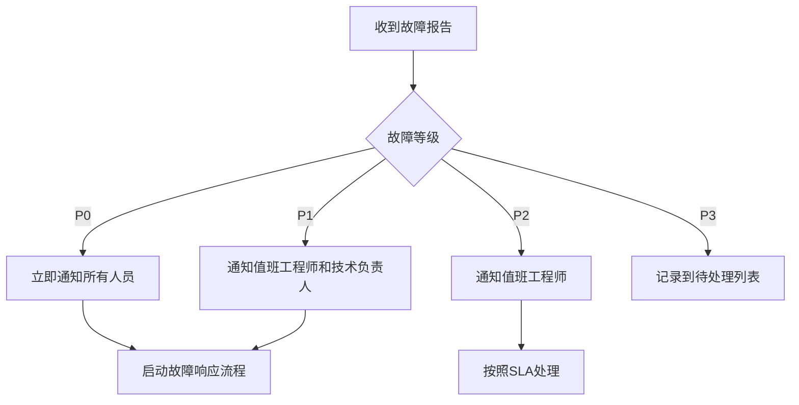

# HTML代码分享项目 - 故障响应流程设计

## 📋 概述

本文档定义了HTML代码分享项目的故障响应流程，旨在确保在发生故障时能够快速、有效地恢复服务，最小化对用户的影响。

## 🎯 故障分级

### P0 - 紧急故障
**定义**: 系统完全不可用，所有用户受影响
**响应时间**: 立即（<5分钟）
**示例**:
- 服务完全宕机
- 数据库连接失败
- 无法创建/查看页面

### P1 - 严重故障
**定义**: 核心功能受损，大部分用户受影响
**响应时间**: 15分钟内
**示例**:
- 页面加载缓慢（>5秒）
- API错误率>10%
- 内存泄漏导致系统不稳定

### P2 - 一般故障
**定义**: 部分功能异常，部分用户受影响
**响应时间**: 1小时内
**示例**:
- 非核心功能不可用
- 页面显示异常
- 性能下降

### P3 - 轻微故障
**定义**: 轻微问题，影响少数用户
**响应时间**: 4小时内
**示例**:
- UI显示问题
- 文档错误
- 性能轻微下降

## 👥 团队角色与职责

### 值班工程师（On-Call）
- **职责**: 
  - 7x24小时响应告警
  - 初步故障诊断
  - 执行标准恢复流程
  - 升级决策
- **要求**: 
  - 熟悉系统架构
  - 具备基本的故障处理能力
  - 保持手机畅通

### 技术负责人
- **职责**:
  - 处理复杂故障
  - 协调资源
  - 技术决策
  - 故障复盘
- **要求**:
  - 深入了解系统
  - 丰富的问题解决经验

### 运维经理
- **职责**:
  - 总体协调
  - 外部沟通
  - 资源调配
  - 流程优化

### 产品经理
- **职责**:
  - 用户沟通
  - 业务影响评估
  - 补救方案制定

## 📞 响应流程

### 1. 故障发现
#### 自动发现
- 监控系统告警
- 健康检查失败
- 自动化测试失败

#### 人工发现
- 用户反馈
- 运维人员主动发现
- 客服报告

### 2. 故障评估


### 3. 故障处理

#### P0/P1故障处理流程
1. **立即响应**（0-5分钟）
   - 确认故障现象
   - 评估影响范围
   - 通知相关人员

2. **快速恢复**（5-30分钟）
   - 执行预定义的恢复方案
   - 回滚最近的变更
   - 切换到备用系统

3. **根本原因分析**（30分钟-2小时）
   - 查看日志
   - 分析监控数据
   - 复现问题

4. **彻底修复**（2-4小时）
   - 实施永久修复
   - 验证修复效果
   - 监控系统状态

#### P2/P3故障处理流程
1. **问题记录**（15分钟内）
   - 创建故障工单
   - 记录故障现象
   - 分配处理人

2. **诊断处理**（按SLA）
   - 分析问题原因
   - 制定解决方案
   - 实施修复

3. **验证关闭**
   - 确认问题解决
   - 更新文档
   - 关闭工单

## 📢 沟通机制

### 内部沟通
- **即时通讯**: 企业微信群/钉钉群
- **电话**: 紧急故障电话通知
- **会议**: 重大故障启动电话会议

### 外部沟通
- **状态页**: status.example.com
- **用户通知**: 邮件/站内信
- **媒体声明**: 重大故障时准备公关声明

### 沟通模板

#### 内部故障通知模板
```
【故障通知】P1 - HTML-GO服务响应缓慢

时间: 2025-09-03 10:30:00
影响: 页面加载缓慢，API响应时间>5秒
状态: 调查中
负责人: 张三（值班工程师）
进展: 正在查看监控数据和日志

下一步: 15分钟后更新
```

#### 用户通知模板
```
【服务异常通知】

尊敬的用户：

我们正在处理页面加载缓慢的问题，技术团队正在紧急修复。

预计恢复时间：11:30
临时解决方案：请刷新页面重试

给您带来的不便，我们深表歉意。

HTML-GO团队
```

## 🛠️ 常见故障处理手册

### 1. 服务宕机
**症状**: 所有页面返回502/503
**处理步骤**:
1. 检查进程状态
   ```bash
   pm2 status
   ```
2. 如果进程停止，重启服务
   ```bash
   pm2 start html-go
   ```
3. 检查端口占用
   ```bash
   netstat -tlnp | grep 8888
   ```
4. 查看错误日志
   ```bash
   pm2 logs html-go
   ```

### 2. 数据库连接失败
**症状**: 页面提示"数据库错误"
**处理步骤**:
1. 检查数据库文件
   ```bash
   ls -la db/html-go.db
   ```
2. 检查磁盘空间
   ```bash
   df -h
   ```
3. 检查数据库进程
   ```bash
   ps aux | grep sqlite
   ```
4. 如果数据库损坏，从备份恢复
   ```bash
   cp backups/html-go_YYYYMMDD.db db/html-go.db
   ```

### 3. 内存泄漏
**症状**: 内存使用持续增长，服务变慢
**处理步骤**:
1. 检查内存使用
   ```bash
   pm2 monit
   ```
2. 执行垃圾回收
   ```bash
   # 通过API触发
   curl -X POST http://localhost:8888/api/admin/memory/gc
   ```
3. 重启服务
   ```bash
   pm2 restart html-go
   ```
4. 分析内存快照，查找泄漏原因

### 4. 磁盘空间不足
**症状**: 系统提示磁盘空间不足
**处理步骤**:
1. 查看磁盘使用情况
   ```bash
   du -sh *
   ```
2. 清理日志文件
   ```bash
   find logs/ -name "*.log" -mtime +7 -delete
   ```
3. 清理临时文件
   ```bash
   rm -rf tmp/*
   ```
4. 扩容磁盘（如果需要）

## 📊 故障报告模板

### 事件报告
```markdown
# 故障事件报告

## 基本信息
- 故障ID: INC-2025-001
- 故障等级: P1
- 开始时间: 2025-09-03 10:30:00
- 恢复时间: 2025-09-03 11:15:00
- 持续时间: 45分钟

## 影响范围
- 受影响用户: 约1000人
- 功能影响: 页面创建和查看
- 业务影响: 中等

## 故障原因
### 根本原因
数据库连接池配置不当，导致连接泄漏

### 触发因素
用户访问量突增，连接池耗尽

## 处理过程
1. 10:30 收到告警
2. 10:32 确认故障现象
3. 10:35 重启服务，临时恢复
4. 10:40 优化连接池配置
5. 11:00 验证修复效果
6. 11:15 监控确认正常

## 改进措施
1. 优化数据库连接池配置
2. 添加连接池监控
3. 实施连接数告警
4. 制定容量规划

## 经验教训
- 需要加强容量规划
- 监控告警需要更全面
- 应急响应流程需要优化
```

## 🔄 复盘流程

### 1. 复盘会议
- **时间**: 重大故障后24小时内
- **参与人员**: 所有相关人员
- **议程**:
  1. 事件回顾
  2. 原因分析
  3. 处理评估
  4. 改进讨论
  5. 行动计划

### 2. 5 Whys分析法
```
问题: 服务响应缓慢
1. 为什么? - 数据库查询慢
2. 为什么? - 没有索引
3. 为什么? - 新功能没有考虑性能
4. 为什么? - 开发流程缺少性能测试
5. 为什么? - 性能要求不明确
```

### 3. 改进跟踪
- 创建改进项目
- 指定负责人
- 设定截止时间
- 定期跟进

## 📱 应急联系表

| 角色 | 姓名 | 电话 | 邮箱 | 备注 |
|------|------|------|------|------|
| 值班工程师 | 张三 | 138xxxx1234 | zhang@xxx.com | 本周值班 |
| 技术负责人 | 李四 | 139xxxx5678 | li@xxx.com |  |
| 运维经理 | 王五 | 137xxxx9012 | wang@xxx.com |  |
| 产品经理 | 赵六 | 136xxxx3456 | zhao@xxx.com |  |

## 🎯 SLA指标

### 响应时间
- P0: <5分钟
- P1: <15分钟
- P2: <1小时
- P3: <4小时

### 解决时间
- P0: <30分钟
- P1: <2小时
- P2: <8小时
- P3: <24小时

### 可用性目标
- 月度可用性: >99.9%
- 年度可用性: >99.95%

## 📚 培训和演练

### 培训计划
1. **新员工培训**
   - 系统架构介绍
   - 故障响应流程
   - 常见问题处理

2. **定期培训**
   - 每月技术分享
   - 季度故障演练
   - 年度应急演习

### 演练方案
```markdown
# 故障演练方案

## 演练目标
- 验证故障响应流程
- 提升团队协作能力
- 发现流程缺陷

## 演练场景
1. 数据库故障
2. 网络中断
3. 服务器宕机
4. 安全事件

## 演练频率
- 小型演练: 每月1次
- 综合演练: 每季度1次
- 全面演习: 每年1次
```

## 📝 文档维护

- 定期更新故障处理手册
- 保持联系信息最新
- 记录每次故障经验
- 持续优化流程

---

*文档版本: 1.0*  
*最后更新: 2025年9月3日*  
*负责人: [待指定]*